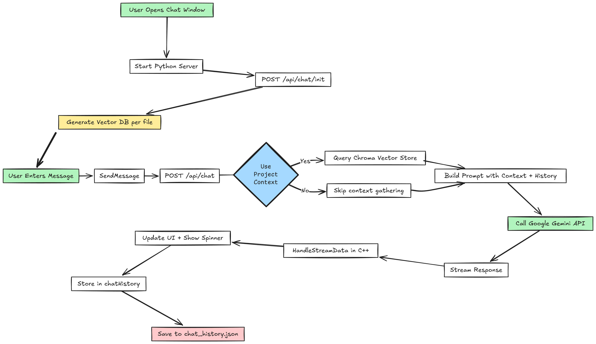

## 🧠 Step-by-Step Flow: How LLM Chat Works in TxEdit

------

### 🪟 **1. Chat Window Initialization**

- When `ChatWindow` is instantiated:

    - It calls `mChatManager.SetBaseURL("localhost", 8000)` to configure the Python backend endpoint.
    - It calls `LoadConversationHistory()` to restore past chats from `.cache/chat_history.json`.

- When `Render()` is called the first time:

    - A thread is launched:

        ```c++
        std::thread server_thread(&ChatWindow::StartServer, this);
        ```

        This executes:

        ```bash
        uvicorn scripts.main:app --host 0.0.0.0 --port 8000 --reload
        ```

        which starts the **FastAPI server** defined in `main.py`.

------

### 🔄 **2. Python Backend Initialization**

- After starting the server, `MakeRequest("INIT")` is called asynchronously:

    ```c++
    mChatManager.InitializeConnectionWithBackend()
    ```

- This does the following:

    - Sends a POST request to `/api/chat/init`.
    - Attaches the current project directory, ignored folders, and file extensions via `llmconfig.json`.
    - The FastAPI route `/api/chat/init` calls `initialize_vector_store()` to:
        - Recursively walk through the project directory.
        - Ignore folders/files based on config.
        - Create/update **Chroma vector stores** (one per file).
        - Save/update metadata for change tracking.

------

### 👤 **3. User Sends a Message**

When the user enters a message and hits **"Send"**, the following happens:

#### C++ Side (`ChatWindow::SendMessage`)

- The message is added to `chatHistory` with type `User`.

- An empty assistant message placeholder is added.

- Then `MakeRequest(userInput)` is launched asynchronously, which does:

    ```c++
    mChatManager.StreamResponse(model, message, useVectorDB)
    ```

------

### 🌐 **4. C++ → Python (HTTP POST to /api/chat)**

#### Sent Payload:

```json
{
  "query": "User's question",
  "use_vector": true/false
}
```

#### Server-side Route: `/api/chat`

- Triggers `generate_response()` coroutine.
- If `use_vector` is true:
    - `query_vector_store()` is invoked.
    - Embeddings are generated for the query using `sentence-transformers`.
    - The query is matched against the vector DB to retrieve relevant chunks of code/docs.
- A `PromptTemplate` is created using:
    - Context (retrieved docs)
    - Query
    - Project structure
    - Conversation history
- The prompt is sent to **Google Gemini API** via `ChatGoogleGenerativeAI`.

------

### 🧠 **5. Streaming the LLM Response**

- Gemini’s response is **streamed token-by-token** using:

    ```python
    for token in chain.stream(input_data):
        yield json.dumps({"type": "response", "content": token.content, "done": False})
    ```

- A final message with `"done": true` is sent once streaming ends.

------

### 🔁 **6. C++ Receives the Stream**

- `LLMChatManager::HandleStreamData()` is called repeatedly:
    - Each token is parsed from JSON and appended to `mResponseText`.
    - This data is passed back to `ChatWindow::HandleStream()` which updates `chatHistory.back().text`.
- While streaming, a spinner is shown in the UI and `chatHistory` is live-updated.

------

### 💾 **7. Saving Chat History**

- After the full response is received, `update_memory()` is triggered:
    - Appends the new user and assistant messages.
    - Saves them into `.cache/chat_history.json`.

------

## 📌 Summary: Data Flow


------

### ✅ Core Technologies Involved

| Component             | Technology                    |
| --------------------- | ----------------------------- |
| Editor UI             | ImGui                         |
| Backend Server        | FastAPI                       |
| Streaming HTTP Client | `cpr` (C++)                   |
| Embeddings            | `sentence-transformers`       |
| Vector Store          | ChromaDB                      |
| LLM                   | Google Gemini (LangChain)     |
| Chat Memory           | LangChain Memory (JSON store) |